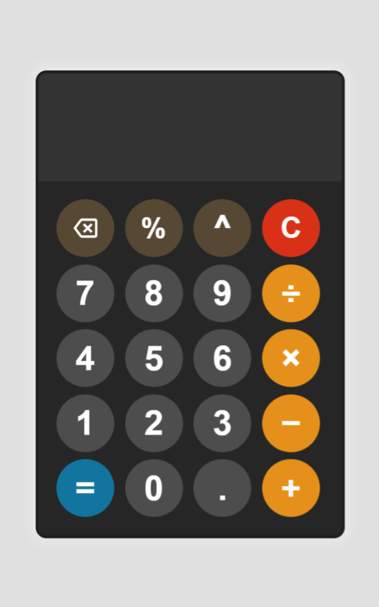

# Calculator App

A modern calculator built using HTML, CSS, and JavaScript that performs real-time arithmetic operations with a clean interface and dynamic display behavior.

## Preview

  

## Features

* Basic arithmetic operations (+, −, ×, ÷)
* Exponentiation using `^`
* Percentage calculations
* Backspace (delete last digit)
* Clear display function
* Error handling for invalid expressions
* Dynamic font resizing for long inputs
* Grid-based responsive layout
* Clean dark theme interface

## Technologies Used

* HTML5
* CSS3 (Grid Layout, styling)
* JavaScript (DOM manipulation, logic)

## Purpose

This project was created to practice building an interactive web application using JavaScript, focusing on DOM updates, user input handling, and responsive UI behavior.

## How to Run

1. Download or clone the project.
2. Open `index.html` in any modern web browser.

No installation or dependencies required.

---

Simple, functional calculator demonstrating core front-end development concepts and interactive UI design.
