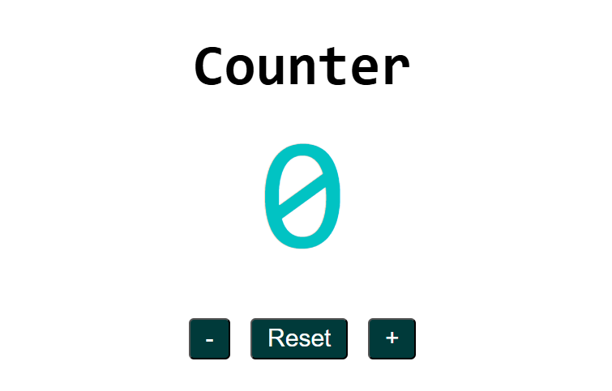

# Counter App

An interactive counter application built using HTML, CSS, and JavaScript that demonstrates real-time DOM updates and event-driven logic.

## Preview

  

## Overview

This project displays a simple numerical counter with buttons to increment, decrement, and reset the value.  
The count updates instantly in response to user interactions without reloading the page.

While straightforward, this implementation reinforces key JavaScript fundamentals and clean event handling.

## Features

- **Increment** the count by 1
- **Decrement** the count by 1
- **Reset** the count back to zero
- Instant UI updates on button clicks
- Clean and minimal UI design

## Key Implementation Details

- Uses `addEventListener` for interaction handling
- DOM elements selected using `querySelector`
- Count state updated in JavaScript and reflected in the DOM
- Buttons provide immediate visual feedback without page refresh

## Concepts Practiced

- DOM selection & manipulation
- Event listeners
- Interactive UI updates
- Application state handling

## Technologies Used

- HTML5  
- CSS3  
- Vanilla JavaScript

## How to Run

1. Open `index.html` in any modern browser.
2. Click the buttons to interact with the counter.

---

This project demonstrates controlled UI updates using core JavaScript logic and is a solid foundational example of interactive front-end functionality.