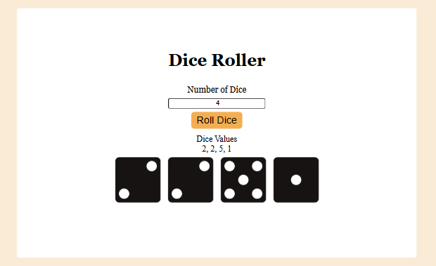

# Dice Roller

An interactive dice simulator built using HTML, CSS, and JavaScript where users enter a number of dice to roll and get random values displayed.

## Preview

  

## Overview

This project allows the user to input how many dice they want to roll and then generates that many random values between 1 and 6.

When the user presses **Enter** in the input field, the JavaScript logic:

1. Reads the number of dice from the input.
2. Generates random values for that many dice.
3. Displays the numeric results in the interface.

There is also preparation in the script to display images for each dice roll but the current implementation uses numeric output.

## Features (As Implemented)

- User input for number of dice
- Random number generation for each dice
- Keyboard support (Enter to roll)
- Numeric result display updated dynamically
- Console output logging of roll results

## Implementation Details

- Uses `Math.floor(Math.random() * 6) + 1` to simulate dice values.
- Stores the results in an array and joins them for display.
- Listens for `keydown` events on the dice input to trigger the roll logic.
- Uses `textContent` and `innerHTML` to update the UI elements.

## Concepts Practiced

- Random number generation in JavaScript
- Event handling (`keydown` + functions)
- DOM updates based on user input
- Array usage for results collection

## Technologies Used

- HTML
- CSS
- Vanilla JavaScript

## How to Run

1. Open `index.html` in your browser.
2. Enter the number of dice you want to roll.
3. Press **Enter** to see the random results displayed.

---

This repository contains the logic for random dice rolls and demonstrates the basics of DOM interaction and real-time UI updates.