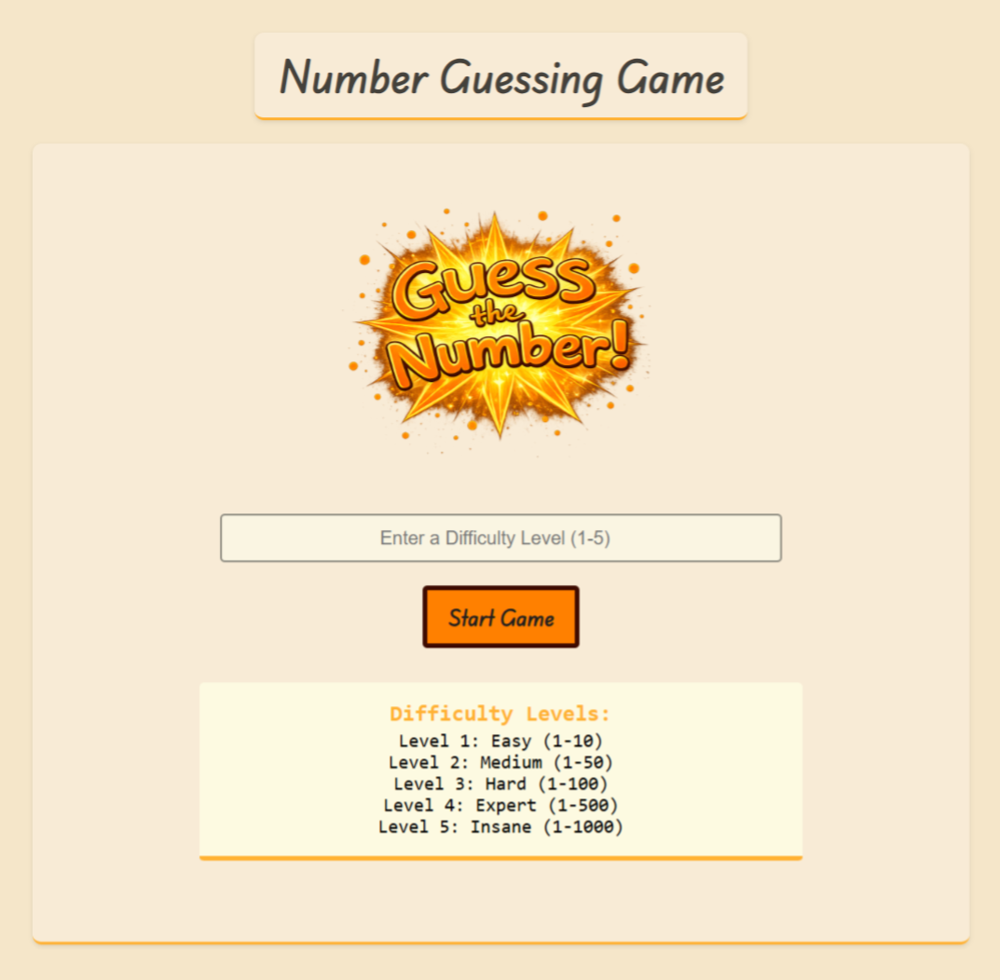

# Number Guessing Game

An interactive number guessing game built with HTML, CSS, and JavaScript that lets users pick a difficulty level and try to guess a random number within the chosen range.

This game emphasizes user interaction, dynamic feedback, difficulty scaling, and DOM manipulation.

## Preview

  

## 🎮 How It Works

1. The user selects a difficulty level from **Easy (1–10)** up to **Insane (1–1000)**.
2. A random target number is generated within the selected range.
3. The player submits guesses and receives instant feedback:
   - “Too high! Guess Lower!”
   - “Too low! Guess Higher!”
   - “Congratulations! You guessed it!”
4. The number of attempts is tracked and displayed.
5. The user can press *Enter* to submit or click buttons to interact.
6. A reset option reloads the game and lets you play again.

## 📌 Features

- Difficulty levels with dynamic range adjustment
- Input validation (ensures valid numbers and correct range)
- Real-time feedback with guesses and attempt counter
- Keyboard support (`Enter` to submit)
- Clean interface transition from difficulty selection to gameplay

## 💡 Key Implementation Details

- Uses `Math.random()` to generate the target number for each playthrough.
- Implements event listeners directly in JavaScript for buttons and `Enter` key events.
- Feedback messages and attempt count update live in the DOM.
- Game logic prevents further guesses once the correct answer is found.
- Difficulty settings control upper range to make the game progressively harder.

## 🛠️ Technologies Used

- HTML5  
- CSS3  
- Vanilla JavaScript (no external libraries)

## 🚀 How to Run

1. Open `index.html` in your browser.
2. Select a difficulty level.
3. Enter your guesses and see the feedback update dynamically.
4. Use the reset button to start a new game.

---

This project demonstrates structured game logic, responsive UI behavior, DOM interaction, and working with dynamic values — great practice for real interactive JavaScript applications!