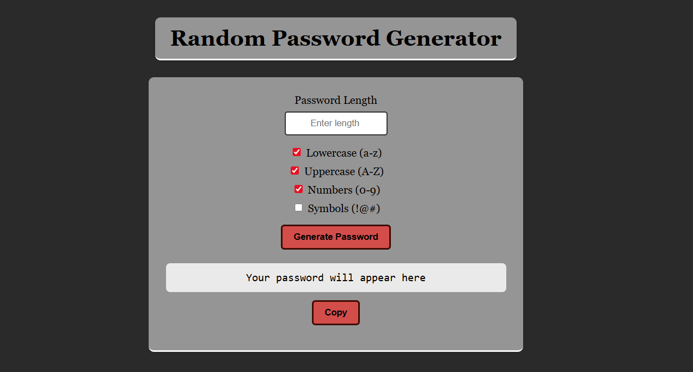

# Password Generator

A dynamic password generator built using HTML, CSS, and JavaScript that creates secure random passwords instantly based on character selection logic.

## Preview

  

## Overview

This project generates random passwords using customizable character logic.  
It focuses on randomness, string manipulation, and dynamic DOM updates.

Unlike static examples, this implementation generates a new password on each interaction and updates the interface instantly without refreshing the page.

## Features

- Random password generation
- Character set combination logic
- Instant UI updates
- Clean interactive layout
- Button-driven generation
- Structured and reusable JavaScript functions

## Key Implementation Details

- Uses `Math.random()` for character selection
- Builds passwords dynamically using loops and string concatenation
- Updates output field directly via DOM manipulation
- Ensures immediate visual feedback on each generation
- Organized logic separated into reusable functions

## Concepts Applied

- Randomization logic
- String handling
- Event listeners
- DOM manipulation
- UI responsiveness

## Technologies Used

- HTML5  
- CSS3  
- Vanilla JavaScript

## How to Run

1. Open `index.html` in your browser.
2. Click the generate button.
3. A new password will be created instantly.