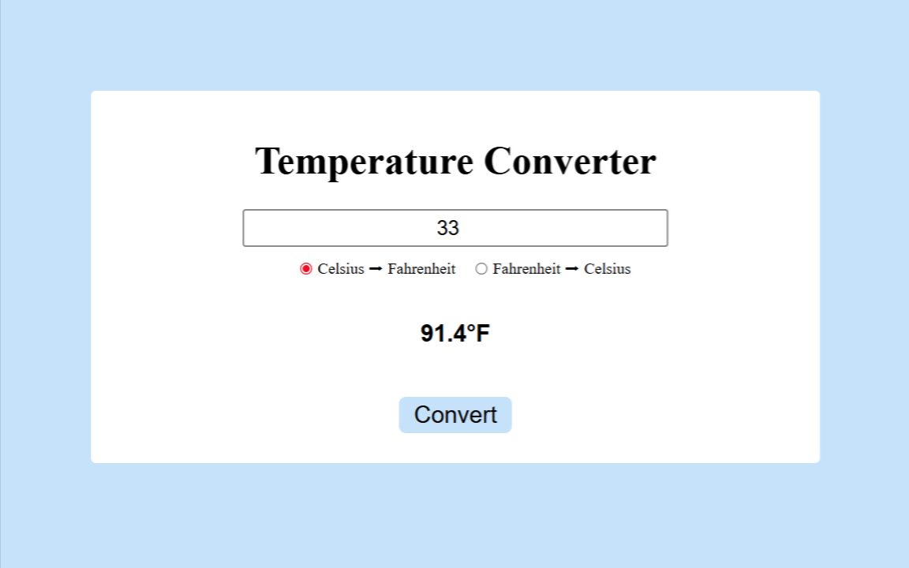

# Temperature Converter

A simple and interactive web app that converts temperatures between **Celsius** and **Fahrenheit** using HTML, CSS, and JavaScript.

## Preview

  

## Overview

This project lets the user enter a temperature value and select whether to convert it to Celsius or Fahrenheit. When the user presses **Enter**, the app performs the conversion and displays the result immediately.

It uses basic JavaScript to read input values, apply correct conversion formulas, and update the page dynamically — no page reload needed.

## Features

- Enter a temperature value using a text input  
- Choose between converting to **Fahrenheit** or **Celsius**  
- Press **Enter** to run the conversion instantly  
- Shows result with one decimal precision  
- Simple and responsive UI

## How It Works

1. User enters a number into the input field.
2. User selects a radio button:  
   * **to Fahrenheit**  
   * **to Celsius**
3. Press **Enter** to convert.
4. JavaScript calculates the value using:
   - **C → F:** `(temp × 9/5) + 32`  
   - **F → C:** `(temp − 32) × 5/9`
5. The converted result appears below.

## Technologies Used

- **HTML5** — page structure  
- **CSS3** — styling and layout  
- **JavaScript** — conversion logic and UI updates

## How to Use

1. Open `index.html` in a browser.
2. Enter a temperature number.
3. Select a conversion type.
4. Press **Enter**.
5. See the result displayed below the button.

---

A lightweight utility to practice DOM manipulation and temperature conversion logic in JavaScript.